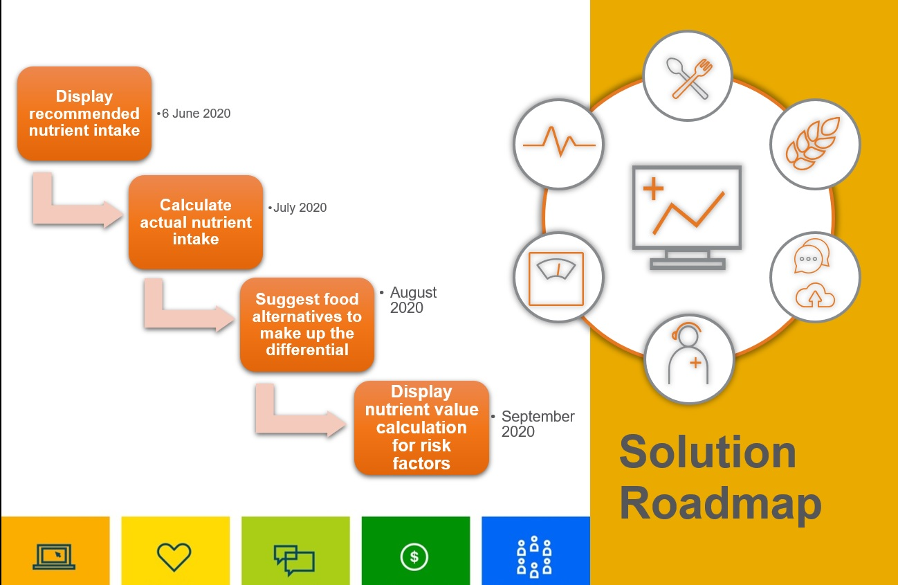

# Submission name

 GitHub repository for Covid Health Ally Website

*Read this in other languages: [English](README.md), [한국어](README.ko.md), [português](README.pt_br.md).*

## Contents

1. [Short description](#short-description)
1. [Demo video](#demo-video)
1. [Long description](#long-description)
1. [Project roadmap](#project-roadmap)
1. [Getting started](#getting-started)
1. [Live demo](#live-demo)
1. [Authors](#authors)


## Short description

Web-based solution to provide nutritional information related to immunity against COVID-19

This is a website created to burst myths, rumours, half knowledege, garbage knowledege about covid 19 do's and dont's and an initiative to provide all the facts and figures related to covid19. Along with that it will be majorly focusing on vitamins and nutrient intakes to boost imunity.
Since high immunity is the best way to stay safe to fight COVID-19, we have developed a website which will :

1.	Calculate vitamin C, D, A, zinc, carbohydrates and protein in user's daily food intake, 
2.	Suggest food alternates to ensure daily intake is maintained per age/gender demographics. 
3.	Flag high carb to user since low-carb diet is recommended.

## Demo video

[![Watch the video]]


## Long description

# Real-world problem
The COVID-19 pandemic is a reality in our world today. Countries across the world were under lockdown while their governments and healthcare grappled with finding solutions and setting up the infrastructure to curb the spread of the disease. Nearly 3,85,926 lives have been lost all across the world. In India, the number of deaths are 6,608 and the total confirmed cases are 2,36,304. As we know these numbers in India have risen sharply after the first phase of the lockdown is being lifted – Unlock 1.0. 

Living with the COVID-19 causing coronavirus around us is being accepted as a long-term problem and being defined as a “New normal”. In the absence of a vaccine, the best safeguard is to stay healthy. Protecting ourselves and our loved ones from contracting the disease is critical. And, the best way to stay safe to fight COVID-19 is to have high immunity. Apart from sleep, exercise, and managing stress, the food we eat forms the most crucial aspect of boosting immunity.

To accelerate the new normal, we need a reliable source of truth for COVID-related health information pertinent to Indian conditions. We did a quick survey amongst our circle of family, friends and colleagues (sample size = 50) before launching solution design. The two questions we asked were; 
1.	What is your main source of information related to COVID?
2.	What are your main COVID questions?
90% of people we asked said that discussions with their circle of family, friends and colleagues, in addition to WhatsApp forwards were their primary source of information. Majority of the questions revolved how we can prevent contracting the virus.


## Project roadmap



## Getting started

These instructions will get you a copy of the project up and running on your local machine for development and testing purposes. See deployment for notes on how to deploy the project on a live system.

### Prerequisites

What things you need to install the software and how to install them

```bash
node.js SDK
```

### Installing

A step by step series of examples that tell you how to get a development env running:


```bash
npm install
npm start
Server running at http://localhost:3000/
dev url : modules/dashboard.html
```

## Pending with
```
https://covid-health-ally.eu-gb.cf.appdomain.cloud/ - this is the expected URL for hosted Web app but due to configuration issues we are unable to see the website.
```

## Authors

See the list of [contributors] who participated in this project:
* **Nivedita Dey** 
* **Garima Jain** 
* **Mitali Srivastava** 
* **Priyanka Joshi** 